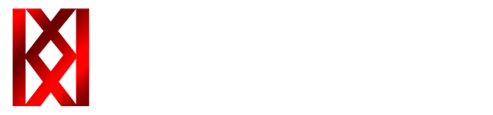

# Alexandr "Revenant" Kior - Trainee Unity Game Developer

## 🛠️ Tech Stack for 

### Using To Code:
- Microsoft Visual Studio 

### Using To Make Post-Production and UI:
- Adobe Photoshop 
- Adobe Premier Pro 

### Using For Write Game Design Documents:
- Notion  

### Using To Make Graphics:
- Aseprite 
- Blender   

## 📚 Education And Study 
I am constantly learning and growing because I believe that continuous development and education are the keys to efficiency and happiness.
### General:
- ITSTEP IT Academy
- Magister Degree Pryazovskyi State Technical University (121 Computer Scince)

### Unity:
- Unity Pathways,
- Youtube Tutorials, 
- Game Jams,
- Documentation

### C#:
- Exercism
- YouTube Tutorials

## Past Expirience:
- Creating a telegram bots with Telebot and Aiogram, Python
- Creating a desktop GUI apps on Python, using FLET Framework

### 🚀 Contacts!
- 📧 Email: [kiordev@gmail.com]
- 🌐 Portfolio: [KIOR.INTERACTIVE]

